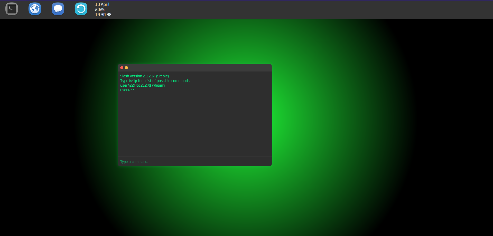
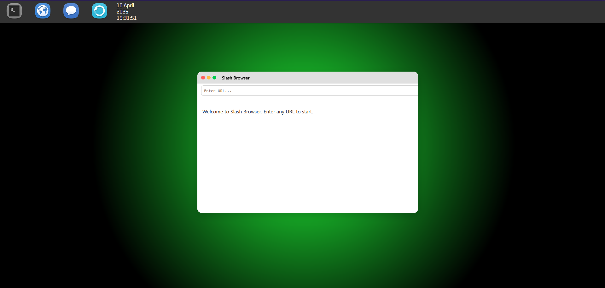
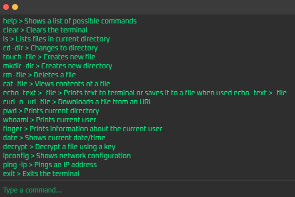

# Decrypted - Escape Room Game [DEMO]

## A hacker-style escape room game made entirely with HTML, CSS and JavaScript

Do you know how to use linux and do you like escape rooms? Then this might be for you...
In this game, you have to follow instructions, use the terminal with its many commands and
try to decrypt encrypted data to proceed. You have a linux-style terminal with many available
commands, a webbrowser and an app to communicate with your boss. Also, you have a dedicated
scripting language which you can use to automate tasks.

As this is only a demo of the upcoming game, there is only one level so far, but there will be more in the
future. Also, this is my first game to develop, so if you have any ideas how to improve it, feel free
to open an issue!





## How to play

To start playing, download the repository and open ```index.html```. From there, just click continue.
For the best experience I recommend using fullscreen mode (F11 in most browsers). Now you should be in
an simulated desktop environment. Have fun playing!



## The terminal

In the terminal, you can interact with a lot of simulated linux-style commands like ```cd```, ```touch```, etc...
Here is a complete list of available commands:

```bash
help                > Shows a list of possible commands
clear               > Clears the terminal
ls                  > Lists files in current directory
cd -dir             > Changes to directory (Use "cd .." to go back)
touch -file         > Creates new file
mkdir -dir          > Creates new directory
rm -file            > Deletes a file
cat -file           > Views contents of a file
echo -text > -file  > Prints text to terminal or saves it to a file when used echo -text > -file
editor -file        > Opens the editor with a specified file (Absolute filepath)
run -file           > Runs a .slash file (Absolute filepath)
curl -o -url -file  > Downloads a file from an URL
pwd                 > Prints current directory
whoami              > Prints current user
finger -user        > Prints information about an user
date                > Shows current date/time
decrypt -file       > Decrypt a file using a key
ipconfig            > Shows network configuration
ping -ip            > Pings an IP address
exit                > Exits the terminal
shutdown            > Shuts down the "OS" (Goes to the start page)
```

Debug commands:

```bash
storefs             > Saves the current state of the simulated filesystem to LocalStorage
loadfs              > Loads a previously saved state of the filesystem
clearfs             > Deletes the filesystem from LocalStorage
```

There are a few hidden commands and easter eggs, but I won't list them here.

## SlashScript

The game has a built-in scripting language called SlashScript that currently
has no purpose for the gameplay, but will be used in later levels.

The language mainly consists of all commands that can be run through the terminal. For example,
the command ```echo``` can be run through the terminal as well as through SlashScript.

To create and run SlashScript, create a ```.slash``` file in any directory with the ```touch``` command.
Next, open the file with the ```editor``` command (Recommended, you can also use ```echo``` but it can be confusing).
Write any SlashScript code and save the file.
To run it, enter ```run -absolute filepath``` (For example: ```run /home/test.slash```). The terminal will now try to
execute it. If a command is not recognised, the terminal will output an error. If there is an error with the SlashScript
Syntax itself, the interpreter will output a custom error.

### Syntax

This is example code with all the current syntax in SlashScript:

```bash
# This is a comment

# Variable declaration
set myNum = 1

# Set myVar to "Hello"
set myVar = "Hello"
echo $myVar

# Set myVar to "World"
set myVar = "World"
echo $myVar

# If/Else
if [myNum == 1]
echo myNum is 1
else
echo myNum is not 1 but $myNum
endif

# For loops
for i in 1 2 3
echo Deploying script $i
endfor

# Function declaration
function intro
    echo === Welcome ===
    echo This is SlashScript!
endfunc

# Function calling
intro

# Function with arguments
function add a b
set sum = $a + $b
return $sum
endfunc

# Calling a function with arguments
set result = call add 3 4
echo $result

# Prompting for input and assigning it
input name = What is your name?
echo Hello, $name!

```

## ToDo-List

- Add more levels
- Add more commands
- Improve the scripting language
- Add a real storyline
